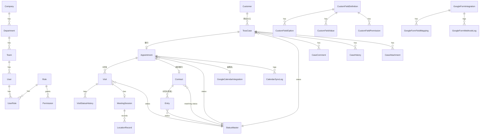

# データベース設計書

主キーはUUID。案件番号(TOS-202608-000001等)は別テーブル`SequenceCounter`で年月+種別ごとに
`SELECT ... FOR UPDATE`によるトランザクション採番を行い、競合を防ぐ。
日時はDB上UTC保存、表示はAsia/Tokyo変換。全主要テーブルに`version`(楽観的ロック)・`updatedAt`・`updatedBy`・`deletedAt`(論理削除)を持たせる。

## 1. ER図(概略, Mermaid)



## 2. 主要モデル(Prismaイメージ、抜粋)

### User / 組織
```prisma
model Company { id String @id @default(uuid()) name String departments Department[] }
model Department { id String @id @default(uuid()) companyId String name String order Int teams Team[] }
model Team { id String @id @default(uuid()) departmentId String name String order Int users User[] }

model User {
  id String @id @default(uuid())
  email String @unique
  passwordHash String
  employeeCode String? @unique
  name String
  departmentId String?
  teamId String?
  status UserStatus @default(ACTIVE) // ACTIVE/SUSPENDED/RETIRED
  hiredAt DateTime?
  retiredAt DateTime?
  iconUrl String?
  displayOrder Int @default(0)
  preferredViewMode ViewMode @default(AUTO) // AUTO/MOBILE/PC
  roles UserRole[]
  refreshTokens RefreshToken[]
  version Int @default(1)
}
model Role { id String @id @default(uuid()) code String @unique name String permissions Permission[] }
model Permission { id String @id @default(uuid()) roleId String resource String action String scope String } // scope: OWN/TEAM/DEPT/ALL
model UserRole { userId String roleId String @@id([userId, roleId]) }
model RefreshToken { id String @id @default(uuid()) userId String tokenHash String expiresAt DateTime revokedAt DateTime? }
```

### 案件系(所属スナップショット重要)
```prisma
model Customer {
  id String @id @default(uuid())
  corporateName String?
  contactName String?
  phone String?
  email String?
  postalCode String? address String? building String?
  version Int @default(1)
}

model TossCase {
  id String @id @default(uuid())
  caseNumber String @unique          // TOS-202608-000001
  receivedAt DateTime
  googleFormResponseId String?
  customerId String?
  productId String?
  sourceId String?
  // 案件作成時点の所属スナップショット(異動後も当時集計できるように)
  snapshotDepartmentId String?
  snapshotTeamId String?
  tossUserId String?
  salesUserId String?
  fieldSalesUserId String?
  desiredAt DateTime?
  confirmedStartAt DateTime? confirmedEndAt DateTime?
  statusId String                     // -> StatusMaster (internalCode基準)
  memo String? tags String[]
  createdBy String updatedBy String
  version Int @default(1)
  deletedAt DateTime?
}

model Appointment {
  id String @id @default(uuid())
  caseNumber String @unique           // APO-202608-000001
  tossCaseId String? @unique          // 二重作成防止のユニーク制約
  customerId String?
  snapshotDepartmentId String? snapshotTeamId String?
  apoUserId String? meetingUserId String? fieldSalesUserId String?
  meetingStartAt DateTime? meetingEndAt DateTime?
  meetingType MeetingType             // VISIT/GOOGLE_MEET/PHONE/OTHER
  visitAddress String?
  meetingUrl String?
  googleCalendarEventId String?
  calendarSyncStatus SyncStatus @default(NOT_SYNCED) // NOT_SYNCED/SYNCING/SYNCED/ERROR
  meetingStatusId String              // -> StatusMaster
  meetingResultId String?
  nextActionAt DateTime?
  idempotencyKey String @unique       // トス→アポ自動移行の冪等性キー
  version Int @default(1)
  deletedAt DateTime?
}

model Visit {
  id String @id @default(uuid())
  caseNumber String @unique           // VIS-202608-000001
  appointmentId String                // 1対多(初回/再訪問/最終確認)
  visitKind String                    // INITIAL/REVISIT/FINAL_CHECK
  fieldSalesUserId String?
  scheduledAt DateTime
  statusId String                     // -> StatusMaster (内部コード判定)
  departedAt DateTime?
  arrivedAt DateTime? arrivedByUserId String?
  arrivedLatitude Float? arrivedLongitude Float? arrivedAccuracy Float?
  arrivedDistanceFromDestination Float?
  arrivedDeviceInfo String? arrivedIpAddress String?
  arrivedComment String? locationPermissionStatus String?
  version Int @default(1)
}

model MeetingSession {
  id String @id @default(uuid())
  visitId String @unique
  meetingStartedAt DateTime? meetingStartedByUserId String?
  meetingStartLatitude Float? meetingStartLongitude Float?
  waitingMinutes Int?
  meetingEndedAt DateTime? meetingEndedByUserId String?
  meetingDurationMinutes Int?
  meetingResult String? nextAction String? nextActionDate DateTime? nextVisitAt DateTime?
  meetingMemo String? customerNeeds String? rejectionReason String?
  estimatedContractProbability Int? contractExpectedDate DateTime?
  meetingEndLatitude Float? meetingEndLongitude Float?
}

model LocationRecord {
  id String @id @default(uuid())
  meetingSessionId String? visitId String?
  eventType String // ARRIVE/MEETING_START/MEETING_END
  latitude Float? longitude Float? accuracy Float?
  capturedAt DateTime @default(now())
}

model Contract {
  id String @id @default(uuid())
  caseNumber String @unique           // CNT-202608-000001
  appointmentId String @unique        // 二重作成防止
  tossCaseId String?
  contractUserId String?
  contractedAt DateTime?
  contractAmount Decimal? revenueForecast Decimal? feeForecast Decimal?
  contractNumber String? applicationNumber String?
  matchingStatusId String              // -> StatusMaster
  matchingAt DateTime? switchingScheduledAt DateTime? switchingAt DateTime?
  entryStatusId String? entryAt DateTime?
  deficiencyNote String? nextActionAt DateTime?
  version Int @default(1)
}

model Entry {
  id String @id @default(uuid())
  caseNumber String @unique           // ENT-202608-000001
  contractId String
  entryUserId String?
  entryAt DateTime?
  statusId String                      // -> StatusMaster
  applicationNumber String?
  deficiencyNote String? resolvedAt DateTime? approvedAt DateTime?
  version Int @default(1)
}
```

### マスタ・自動処理・カスタム項目
```prisma
model Product { id String @id @default(uuid()) name String active Boolean @default(true) }
model Source { id String @id @default(uuid()) name String active Boolean @default(true) }

model StatusMaster {
  id String @id @default(uuid())
  category String        // TOSS/APPOINTMENT/VISIT/MATCHING/ENTRY
  internalCode String     // TOSS_APPOINTMENT 等、自動処理はこれで判定(表示名変更に非依存)
  displayName String
  color String?
  order Int
  active Boolean @default(true)
  @@unique([category, internalCode])
}

model StatusAutomationRule {
  id String @id @default(uuid())
  statusMasterId String
  action String            // CREATE_APPOINTMENT/CREATE_CALENDAR_EVENT/CREATE_MEET/... (固定enum的文字列)
  config Json               // アクション別パラメータ
  active Boolean @default(true)
}

model CustomFieldDefinition {
  id String @id @default(uuid())
  entityType String        // CUSTOMER/TOSS/APPOINTMENT/VISIT/CONTRACT/ENTRY
  fieldKey String           // 一度使ったら変更不可(再利用制限)
  label String description String?
  dataType String           // TEXT/TEXTAREA/INT/DECIMAL/CURRENCY/PHONE/EMAIL/URL/DATE/DATETIME/TIME/SELECT/MULTISELECT/CHECKBOX/USER/DEPT/TEAM/PRODUCT/FORMULA
  required Boolean @default(false)
  defaultValue String? placeholder String?
  validationRule Json?
  showInList Boolean @default(false) showInDetail Boolean @default(true)
  showInCreate Boolean @default(true) showInEdit Boolean @default(true)
  searchable Boolean @default(false) filterable Boolean @default(false)
  csvExportable Boolean @default(true) csvImportable Boolean @default(true)
  order Int active Boolean @default(true) deletedAt DateTime?
  @@unique([entityType, fieldKey])
}
model CustomFieldOption { id String @id @default(uuid()) fieldId String label String value String order Int }
model CustomFieldValue {
  id String @id @default(uuid())
  fieldId String entityType String entityId String
  textValue String? numberValue Decimal? dateValue DateTime? dateTimeValue DateTime?
  booleanValue Boolean? jsonValue Json?
  @@index([entityType, entityId])
}
model CustomFieldPermission { id String @id @default(uuid()) fieldId String roleId String canView Boolean canEdit Boolean }
```

### 履歴・通知・連携
```prisma
model CaseComment { id String @id @default(uuid()) entityType String entityId String userId String body String createdAt DateTime @default(now()) }
model CaseAttachment { id String @id @default(uuid()) entityType String entityId String url String fileName String uploadedBy String createdAt DateTime @default(now()) }
model CaseHistory { id String @id @default(uuid()) entityType String entityId String field String before Json? after Json? changedBy String changedAt DateTime @default(now()) }
model AuditLog {
  id String @id @default(uuid())
  actorUserId String? action String
  ipAddress String? userAgent String?
  targetType String? targetId String?
  before Json? after Json?
  success Boolean errorMessage String?
  createdAt DateTime @default(now())
}
model Notification { id String @id @default(uuid()) userId String type String payload Json readAt DateTime? createdAt DateTime @default(now()) }

model GoogleFormIntegration {
  id String @id @default(uuid())
  name String googleFormId String
  targetCaseType String webhookSecret String active Boolean @default(true)
  duplicateRule String @default("ADMIN_REVIEW") // REJECT/CREATE_NEW/APPEND_EXISTING/ADMIN_REVIEW
  defaultStatusId String? defaultDepartmentId String? defaultTeamId String? defaultUserId String?
  lastReceivedAt DateTime? lastSuccessAt DateTime? lastError String?
  mappings GoogleFormFieldMapping[]
}
model GoogleFormFieldMapping {
  id String @id @default(uuid()) integrationId String
  sourceFieldKey String
  targetType String   // SYSTEM_FIELD/CUSTOM_FIELD/FIXED_VALUE/IGNORE
  targetKey String? fixedValue String?
  transform String?    // CONCAT/DATE_CONVERT/OPTION_REPLACE
}
model GoogleFormWebhookLog {
  id String @id @default(uuid()) integrationId String
  responseId String rawPayload Json
  status String // RECEIVED/PROCESSED/ERROR/UNMAPPED_PARTIAL
  errorMessage String? createdAt DateTime @default(now())
}

model GoogleCalendarIntegration {
  id String @id @default(uuid())
  accountEmail String calendarId String timezone String @default("Asia/Tokyo")
  defaultDurationMinutes Int @default(60)
  titleTemplate String descriptionTemplate String
  sendInvite Boolean @default(true) addCustomerAsGuest Boolean @default(false) createMeet Boolean @default(true)
  accessTokenEnc String? refreshTokenEnc String? tokenExpiresAt DateTime?
  active Boolean @default(true)
}
model CalendarSyncLog { id String @id @default(uuid()) appointmentId String action String success Boolean errorMessage String? createdAt DateTime @default(now()) }

model OfflineAction {
  id String @id @default(uuid())
  idempotencyKey String @unique
  userId String actionType String targetEntityId String
  payload Json capturedAt DateTime
  status String @default("PENDING") // PENDING/SYNCED/FAILED
  retryCount Int @default(0)
}
model SystemSetting { key String @id value Json }
model SavedFilter { id String @id @default(uuid()) userId String screen String name String query Json }
```

## 3. インデックス方針(初期)

`caseNumber`(unique), `statusId`, 各`*UserId`, `snapshotDepartmentId`, `snapshotTeamId`,
`customerId`, `phone`/`email`(Customer), `receivedAt`/`meetingStartAt`/`scheduledAt`/`contractedAt`/`entryAt`,
`CustomFieldValue(entityType, entityId)` の複合インデックスを初期マイグレーションから付与する。
